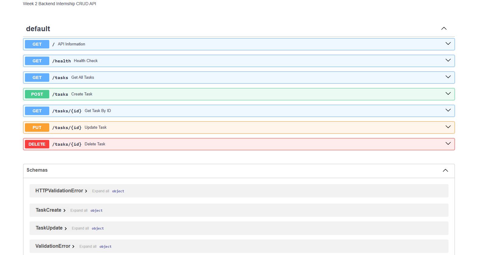

# Task API

A simple CRUD API built using FastAPI for Week 2 Backend Internship Assignment.

## Features

- Create Tasks
- Read All Tasks
- Read Task by ID
- Update Tasks
- Delete Tasks
- Swagger Documentation

---

## Installation

```bash
pip install -r requirements.txt
```

---

## Run

```bash
python -m uvicorn main:app --reload
```

Open

```
http://127.0.0.1:8000/docs
```

---

## Endpoints

| Method | Endpoint | Description |
|---------|----------|-------------|
| GET | / | API Information |
| GET | /health | Health Check |
| GET | /tasks | Get All Tasks |
| GET | /tasks/{id} | Get Task By ID |
| POST | /tasks | Create Task |
| PUT | /tasks/{id} | Update Task |
| DELETE | /tasks/{id} | Delete Task |

---

## Sample curl

```bash
curl -X GET http://127.0.0.1:8000/tasks
```

---

## Swagger

## Swagger UI

Below is the Swagger UI for the Task API.


