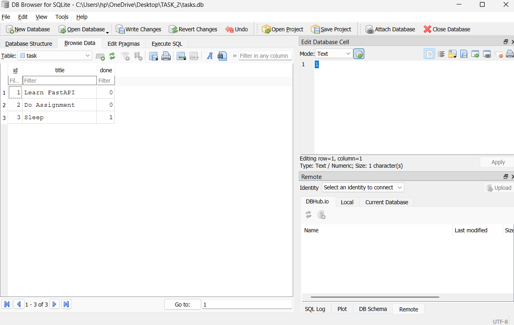

# Task API

A simple CRUD Task Management API built using **FastAPI** and **SQLite**.

## Features

- Create Tasks
- Read All Tasks
- Read Task by ID
- Update Tasks
- Delete Tasks
- SQLite Database Integration
- Data Persists After Server Restart
- Swagger Documentation

---

## Why SQLite?

SQLite was chosen because it is lightweight, requires no separate database server, and stores all data in a single file (`tasks.db`). It is perfect for small backend applications and learning SQL.

---

## Database

- Database: SQLite
- Database File: `tasks.db`
- Table Name: `task`

The database and table are automatically created when the application starts.

---

## Installation

```bash
pip install -r requirements.txt
```

---

## Run

```bash
python -m uvicorn app.main:app --reload
```

Open Swagger UI:

```
http://127.0.0.1:8000/docs
```

---

## Endpoints

| Method | Endpoint | Description |
|---------|----------|-------------|
| GET | / | API Information |
| GET | /health | Health Check |
| GET | /tasks | Get All Tasks |
| GET | /tasks/{id} | Get Task By ID |
| POST | /tasks | Create Task |
| PUT | /tasks/{id} | Update Task |
| DELETE | /tasks/{id} | Delete Task |

---

## Example SQL Query

```sql
SELECT * FROM task;
```

---

## Project Structure

```
FlyRank_AI_Backend_Intern/
│
├── app/
│   ├── main.py
│   └── database.py
│
├── requirements.txt
├── README.md
├── swagger.png
└── database.png
```

---

## Database Screenshot



---

## Swagger UI


